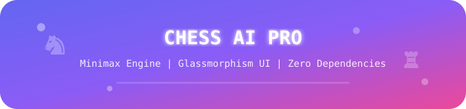
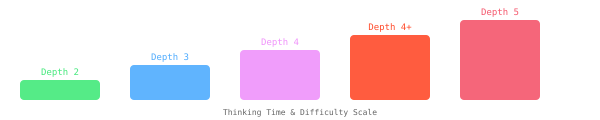
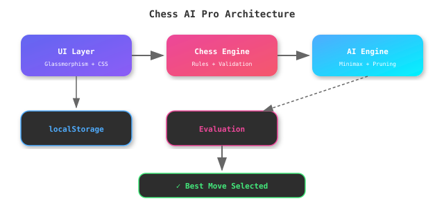

<div align="center">

<!-- Animated Chess Banner -->


<!-- Badges -->


<!-- Animated Status -->


</div>

---

## 📋 Table of Contents

| # | Section | # | Section |
|---|---------|---|---------|
| 1 | [Overview](#-overview) | 6 | [AI Engine](#-ai-engine) |
| 2 | [Features](#-features) | 7 | [Architecture](#-architecture) |
| 3 | [Installation](#-installation) | 8 | [Project Structure](#-project-structure) |
| 4 | [Controls](#-controls) | 9 | [FAQ](#-faq) |
| 5 | [Difficulty Levels](#-difficulty-levels) | 10 | [Credits](#-credits) |

---

## ♟️ Overview

**Chess AI Pro** is a beautiful, interactive chess game with an AI opponent — built entirely with **vanilla HTML, CSS, and JavaScript**. No frameworks, no libraries, no build tools. Just open `index.html` and play.

The game features a **minimax algorithm with alpha-beta pruning** for the AI, a modern **glassmorphism UI** with gradient accents, smooth animations, sound effects, and full chess rule implementation including castling, en passant, and pawn promotion.

---

## ✨ Features

### Core Gameplay

| Feature | Description |
|---------|-------------|
| ♟️ **Full Chess Rules** | Castling (kingside + queenside), en passant, pawn promotion |
| 🤖 **AI Opponent** | Minimax with alpha-beta pruning, 5 difficulty levels |
| 🎯 **Move Highlighting** | Visual feedback for selected pieces and legal moves |
| 📜 **Move History** | Click-through game history to review past moves |
| ↩️ **Undo** | Undo moves (single in 2-player, dual moves vs AI) |
| 👑 **Checkmate Detection** | Automatic checkmate, stalemate, and draw detection |
| 🔄 **Board Flip** | Rotate 180° to play from either perspective |
| 📊 **Material Counter** | Track captured pieces and material advantage |
| 📈 **Evaluation Bar** | Real-time position evaluation display |

### UI/UX

| Feature | Description |
|---------|-------------|
| 🎨 **Glassmorphism** | Liquid-glass aesthetic with gradient accents |
| 📱 **Responsive** | Works on desktop, tablet, and mobile |
| 🔊 **Sound Effects** | Audio feedback for moves, captures, and checks |
| ♿ **Accessibility** | ARIA labels, keyboard navigation, screen reader support |
| 💾 **Auto-Save** | Game persists in browser localStorage |

---

## 📦 Installation

<details open>
<summary><b>Quick Start (No Dependencies)</b></summary>

<br>

```bash
# Clone the repo
git clone https://github.com/ISMAILdz13/chess-ai-pro.git
cd chess-ai-pro

# Option 1: Just open index.html in your browser
open index.html        # macOS
xdg-open index.html    # Linux
start index.html       # Windows

# Option 2: Use a local server (recommended)
python3 -m http.server 8000
# Then visit http://localhost:8000
```

</details>

<details>
<summary><b>GitHub Pages Deployment</b></summary>

<br>

```bash
# Push to your repo, then enable GitHub Pages:
# Settings → Pages → Source → Deploy from branch → main
# Your game will be live at:
# https://ISMAILdz13.github.io/chess-ai-pro/
```

</details>

<details>
<summary><b>Embed in Website</b></summary>

<br>

```html
<iframe src="https://ISMAILdz13.github.io/chess-ai-pro/" 
        width="100%" height="800" frameborder="0">
</iframe>
```

</details>

---

## 🎮 Controls

| Control | Action | Keyboard |
|---------|--------|----------|
| Click piece | Select piece | — |
| Click highlighted square | Make move | — |
| New Game | Reset to starting position | `N` |
| 🤖 AI Toggle | Enable/disable AI opponent | `A` |
| ↩️ Undo | Undo last move(s) | `U` |
| 🔄 Flip | Rotate board 180° | `F` |
| Difficulty dropdown | Change AI search depth | `D` |

### Keyboard Shortcuts
| Key | Action |
|-----|--------|
| `N` | New game |
| `A` | Toggle AI |
| `U` | Undo |
| `F` | Flip board |
| `D` | Focus difficulty selector |
| `Esc` | Deselect piece |

---

## 🎯 Difficulty Levels

<div align="center">

| Level | Search Depth | Thinking Time | Best For |
|-------|-------------|--------------|----------|
| Beginner | 2 | Instant | Learning the basics |
| Intermediate (default) | 3 | < 1s | Casual play |
| Advanced | 4 | ~1-2s | Competitive |
| Master | 4+ | ~2-4s | Strong challenge |
| Grandmaster | 5 | ~5-15s | Maximum difficulty |

<!-- Difficulty visualization SVG -->


</div>

---

## 🤖 AI Engine

The AI uses the **minimax algorithm with alpha-beta pruning** — the classic approach for two-player zero-sum games like chess.

### How It Works

<details open>
<summary><b>Algorithm Breakdown</b></summary>

<br>

1. **Move Generation** — All legal moves are generated for the current position using the chess engine library (embedded in `index.html`)
2. **Tree Search** — The algorithm searches ahead to the configured depth (2-5 moves)
3. **Position Evaluation** — Each leaf position is scored using:
   - **Material balance** (piece values: pawn=1, knight=3, bishop=3, rook=5, queen=9)
   - **Piece-square tables** (positional bonuses for piece placement)
   - **Mobility** (number of legal moves available)
   - **King safety** (castling status, pawn shield)
4. **Alpha-Beta Pruning** — Branches that can't affect the final decision are pruned, dramatically reducing the search space
5. **Move Selection** — The move with the best minimax value is chosen

</details>

<details>
<summary><b>Position Evaluation Formula</b></summary>

<br>

```
Score = Σ(material_value[piece] + piece_square_table[piece][square])
        + mobility_bonus
        + king_safety_bonus
        - opponent_threats
```

**Piece Values:**
| Piece | Value |
|-------|-------|
| Pawn | 1 |
| Knight | 3 |
| Bishop | 3 |
| Rook | 5 |
| Queen | 9 |
| King | ∞ (not capturable) |

</details>

---

## 🏗️ Architecture

<div align="center">



</div>

### Data Flow
1. **Player clicks** → UI Layer captures input → Chess Engine validates move
2. Chess Engine updates board state → UI re-renders pieces
3. AI Engine generates legal moves → searches game tree → evaluates positions
4. Best move is selected → Chess Engine applies it → UI animates the move
5. Game state saved to localStorage

---

## 📁 Project Structure

```
chess-ai-pro/
├── index.html    # Single-file app — all HTML, CSS, and JS
├── README.md     # This file
├── LICENSE        # MIT License
└── .gitignore
```

> **Everything is in one file.** The chess engine, AI logic, UI, styling, and sound effects are all embedded in `index.html`. No build step, no dependencies, no npm install.

---

## ❓ FAQ

<details>
<summary><b>Do I need to install anything?</b></summary>

No! Just open `index.html` in any modern browser. No dependencies, no build tools, no server required.

</details>

<details>
<summary><b>How strong is the AI?</b></summary>

At Grandmaster level (depth 5), the AI is quite challenging for casual players. It won't beat a titled player, but it provides a solid game for most people. Depth 5 with alpha-beta pruning typically evaluates tens of thousands of positions per move.

</details>

<details>
<summary><b>Can I play against another human?</b></summary>

Yes! Toggle off the AI button (🤖 AI: OFF) and two players can take turns on the same device.

</details>

<details>
<summary><b>Does it work on mobile?</b></summary>

Yes, the UI is fully responsive. Tap to select pieces and tap highlighted squares to move. The layout adapts to phone and tablet screens.

</details>

<details>
<summary><b>Is my game saved?</b></summary>

Yes, the game state is automatically saved to your browser's localStorage. Close the tab and come back later — your game will still be there.

</details>

<details>
<summary><b>Can I embed this on my website?</b></summary>

Yes! Use an iframe pointing to the GitHub Pages URL:
```html
<iframe src="https://ISMAILdz13.github.io/chess-ai-pro/" 
        width="100%" height="800" frameborder="0"></iframe>
```

</details>

<details>
<summary><b>What chess rules are supported?</b></summary>

All standard chess rules: castling (kingside + queenside), en passant, pawn promotion (with piece selection dialog), check, checkmate, stalemate, threefold repetition, insufficient material, and the 50-move rule.

</details>

<details>
<summary><b>How does the evaluation bar work?</b></summary>

The evaluation bar shows the relative position strength. A full bar pointing toward White means White is winning. The score (e.g., +2.5) represents the material advantage in pawns.

</details>

---

## 👤 Credits

- **Developer**: ISMAILdz13 (@ISMAILdz13)
- **Repository**: [github.com/ISMAILdz13/chess-ai-pro](https://github.com/ISMAILdz13/chess-ai-pro)
- **Chess Engine**: Custom implementation embedded in `index.html`
- **AI Algorithm**: Minimax with alpha-beta pruning

---

## 📄 License

MIT License — see [LICENSE](LICENSE) file.

---

<div align="center">


⭐ **Star this repo if you like it!** ⭐

</div>
